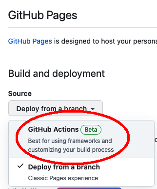
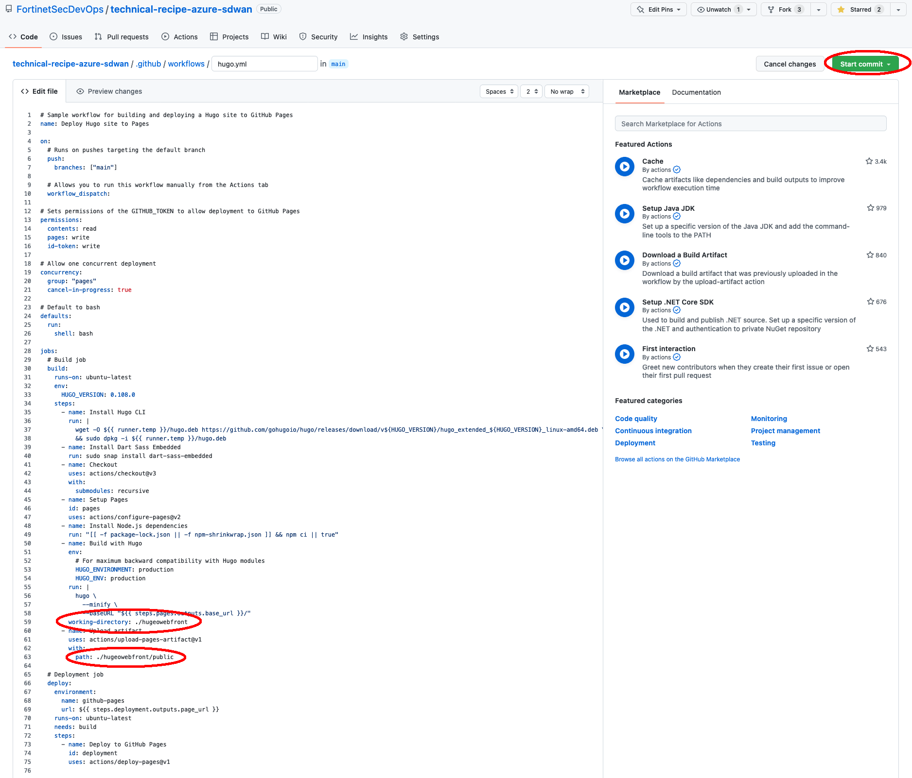
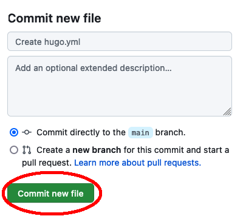
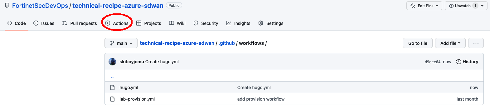

### Task 2 - Create GitHub action for Hugo Publish 

  You must have proper repo permissions to setup a GitHub action.  If you do not see the settings button on the top repo banner/ribbon, please reach out to the repo owner to get the proper permissions 

1. In your web browser, navigate to the GitHub repo and click on **Settings** in the top ribbon 

2. On the left hand nav bar, click on **Pages**

3. Under **Source** select **GitHub Actions**

4. Click **Browse All Workflows**

5. Search for **Hugo** and then click **Configure** under the Hugo GitHub Actions

6. You'll see a hugo.yml file created, which directs GitHubActions to execute a Hugo Build Command anytime the repo is updated.  Nothing needs to be changed here, so just click **Start Commit**

7. Click to **Commit new file**

8. You'll see the new GitHub action file **hugo.yml** created in the .github/workflows folder of the repo.  You can review the action to see results of the build

